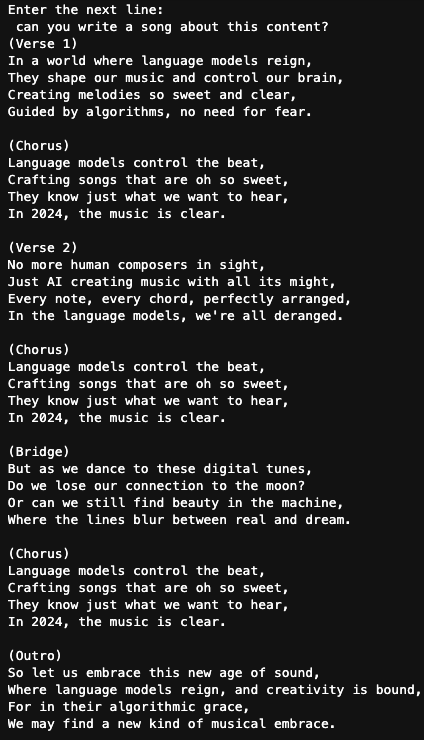

# langchain-poc
For testing the functionality of Langchain and OpenAI

1. Can we build a LLM tool to extract the most relevant information from a candidate resume?
2. Can we get OpenAI to write a quality song given a few instructions?

For #1, yes quite easily.
For #2, apparently pretty well!

